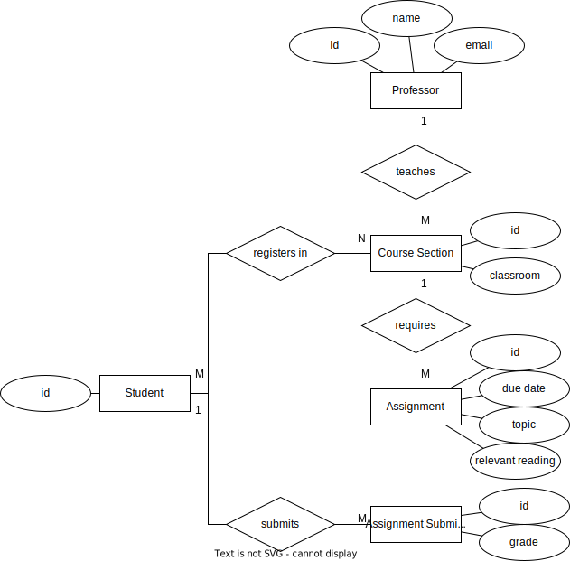

# Data Normalization and Entity-Relationship Diagramming

## Original data set

| assignment_id | student_id | due_date | professor | assignment_topic                | classroom | grade | relevant_reading    | professor_email   |
| :------------ | :--------- | :------- | :-------- | :------------------------------ | :-------- | :---- | :------------------ | :---------------- |
| 1             | 1          | 23.02.21 | Melvin    | Data normalization              | WWH 101   | 80    | Deumlich Chapter 3  | l.melvin@foo.edu  |
| 2             | 7          | 18.11.21 | Logston   | Single table queries            | 60FA 314  | 25    | Dümmlers Chapter 11 | e.logston@foo.edu |
| 1             | 4          | 23.02.21 | Melvin    | Data normalization              | WWH 101   | 75    | Deumlich Chapter 3  | l.melvin@foo.edu  |
| 5             | 2          | 05.05.21 | Logston   | Python and pandas               | 60FA 314  | 92    | Dümmlers Chapter 14 | e.logston@foo.edu |
| 4             | 2          | 04.07.21 | Nevarez   | Spreadsheet aggregate functions | WWH 201   | 65    | Zehnder Page 87     | i.nevarez@foo.edu |
| ...           | ...        | ...      | ...       | ...                             | ...       | ...   | ...                 | ...               |

The original data set is not 4NF compliant.

- 1st normal form is satisfied - each record has the same fields, with only one value per field.
- 2nd normal form is satisfied - there is no composite key indicated and no likely candidate composite keys, so it does not apply.
- 3rd normal form is not satisfied - there are many fields that are facts about non-key fields. For example, `due date` is a fact about an assignment, yet neither `assignment_id` nor `assignment_title` - two fields that seem to be candidate keys - can be a primary key field because they contains multiple records with the same values in these fields.
- 4th normal form is not satisfied - it requires 3rd normal form to be satisfied, which it is not.

## Modified data set

A 4th normal form-compliant version of this data set splits the data into multiple tables:

### students

Information about students.

- While the only student-related field in the original table is the `student_id` field, any `student` table is likely to contain other information about each student.
- So, we've added `email` here, even though it is not required.

| id  | email              |
| :-- | :----------------- |
| 1   | as5092@foo.bar.edu |
| 2   | aa4513@foo.bar.edu |
| 3   | zi5900@foo.bar.edu |
| 4   | ot5925@foo.bar.edu |
| ... | ...                |

This table is 4NF-compliant:

- 1NF is satisfied - each record has the same set of fields, and only one value per field.
- 2NF is satisfied - there is no compound key, so it does not apply.
- 3NF is satisfied - the non-key field is descriptive of the entity identified by the primary key. (i.e. `email` is descriptive of a given student)
- 4NF is satisfied - there are no fields containing independent multi-valued facts.

### professors

Information about professors.

- `last_name` and `email` fields in the original data set were descriptive of professors.
- While `email` is relatively sure to be unique for each professor, we have chosen to create a surrogate key, `id` to serve as primary key instead. This helps avoid update anomalies, so changing a professor's email address doesn't require changes to all references in other tables to that professor.

| id  | last_name | email             |
| :-- | :-------- | :---------------- |
| 1   | Melvin    | l.melvin@foo.edu  |
| 2   | Logston   | e.logston@foo.edu |
| 3   | Nevarez   | i.nevarez@foo.edu |
| ... | ...       | ...               |

This table is 4NF-compliant:

- 1NF is satisfied - each record has the same set of fields, and only one value per field.
- 2NF is satisfied - there is no compound key, so it does not apply.
- 3NF is satisfied - the non-key fields are descriptive of the entity identified by the primary key (i.e. `last_name` and `email` are descriptive of a given professor).
- 4NF is satisfied - there are no fields containing independent multi-valued facts.

### sections

Information about a particular section of a course.

- `professor` and `classroom` fields in the original data set were descriptive of course sections.
- Since the same professor might teach separate course sections in the same classroom, we cannot use either of them, or both of them, as a primary key.
- So we create a surrogate `id` field to serve as the primary key.
- And since the `professor` information has been moved to a professors table, we include, `professor_id` as a foreign key to the relevant record in that table.

| id  | professor_id | classroom |
| :-- | :----------- | :-------- |
| 1   | 1            | WWH 101   |
| 2   | 2            | 60FA 314  |
| 3   | 1            | WWH 101   |
| 4   | 2            | 60FA 314  |
| 5   | 3            | WWH 201   |
| ... | ...          | ...       |

This table is 4NF-compliant:

- 1NF is satisfied - each record has the same set of fields, and only one value per field.
- 2NF is satisfied - there is no compound key, so it does not apply.
- 3NF is satisfied - the non-key fields are descriptive of the entity identified by the primary key (i.e. `last_name` and `email` are descriptive of a given professor).
- 4NF is satisfied - there are no fields containing independent multi-valued facts.

Note that the data about sections of a course might lead you to believe that there should be a `courses` table with basic information about the course that is the same for each section. For example, we could reasonably imagine that the course title, description, and so on might be stored in such a table, whereas the `sections` table would contain only that information that is different from one section of the course to another. This is generally a good idea, but there is no data in our original data set about the course. We only have details that are descriptive of a particular section of the course.

### assignments

Information about a particular assignment given in a particular section.

- In the original data set, `assignment_id`, `due_date`, `assignment_topic`, and `relevant_reading` were descriptive of assignments.
- The original data set also contained information related the section in which a given assignment was assigned (i.e. `professor` and `classroom`), which we can now refer to by a `section_id` - a foreign key to a record in the `sections` table.

| id  | section_id | due_date | topic                           | relevant_reading    |
| :-- | :--------- | :------- | :------------------------------ | :------------------ |
| 1   | 1          | 23.02.21 | Data normalization              | Deumlich Chapter 3  |
| 2   | 2          | 18.11.21 | Single table queries            | Dümmlers Chapter 11 |
| 3   | 5          | 04.07.21 | Spreadsheet aggregate functions | Zehnder Page 87     |
| 4   | 2          | 05.05.21 | Python and pandas               | Dümmlers Chapter 14 |
| ... | ...        | ...      | ...                             | ...                 |

This table is 4NF-compliant:

- 1NF is satisfied - each record has the same set of fields, and only one value per field.
- 2NF is satisfied - there is no compound key, so it does not apply.
- 3NF is satisfied - the non-key fields are descriptive of the entity identified by the primary key (i.e. `last_name` and `email` are descriptive of a given professor).
- 4NF is satisfied - there are no fields containing independent multi-valued facts.

### assignments_submissions

Information about a given student's submission of a given assignment.

- In the original data, `assignment_id`, `student_id`, and `grade` were descriptive of a given student's submission of a given assignment.
- If we assume that any given student can only submit any given assignment once, then we could use the combination of `assignment_id` and `student_id` as a composite key. However, just in case we may want to allow a student to submit an assignment more than once, we have created a surrogate key, `id`. Since our table design allows a student to make multiple submissions of the same assignment, we may want to add a `created` field that stores the timestamp of each submission, so that we can easily see which is the most recent.

| id  | assignment_id | student_id | grade |
| :-- | :------------ | :--------- | :---- |
| 1   | 1             | 1          | 80    |
| 2   | 2             | 4          | 25    |
| 3   | 1             | 3          | 75    |
| 4   | 4             | 2          | 92    |
| 5   | 3             | 2          | 65    |
| ... | ...           | ...        | ...   |

This table is 4NF-compliant:

- 1NF is satisfied - each record has the same set of fields, and only one value per field.
- 2NF is satisfied - there is no compound key, so it does not apply.
- 3NF is satisfied - the non-key fields are descriptive of the entity identified by the primary key (i.e. `last_name` and `email` are descriptive of a given professor).
- 4NF is satisfied - there are no fields containing independent multi-valued facts.

## Entity-relationship diagram

The following diagram represents the 4NF-compliant version of this data.

