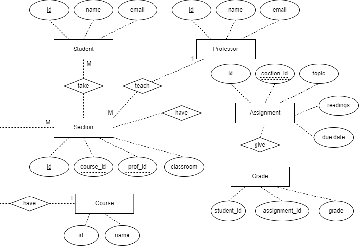

# Data Normalization and Entity-Relationship Diagramming
## Original Table
| assignment_id | student_id | due_date | professor | assignment_topic                | classroom | grade | relevant_reading    | professor_email   |
| :------------ | :--------- | :------- | :-------- | :------------------------------ | :-------- | :---- | :------------------ | :---------------- |
| 1             | 1          | 23.02.21 | Melvin    | Data normalization              | WWH 101   | 80    | Deumlich Chapter 3  | l.melvin@foo.edu  |
| 2             | 7          | 18.11.21 | Logston   | Single table queries            | 60FA 314  | 25    | Dümmlers Chapter 11 | e.logston@foo.edu |
| 1             | 4          | 23.02.21 | Melvin    | Data normalization              | WWH 101   | 75    | Deumlich Chapter 3  | l.melvin@foo.edu  |
| 5             | 2          | 05.05.21 | Logston   | Python and pandas               | 60FA 314  | 92    | Dümmlers Chapter 14 | e.logston@foo.edu |
| 4             | 2          | 04.07.21 | Nevarez   | Spreadsheet aggregate functions | WWH 201   | 65    | Zehnder Page 87     | i.nevarez@foo.edu |
| ...           | ...        | ...      | ...       | ...                             | ...       | ...   | ...                 | ...               |

## Convert to 4NF
In order for the original table to be satisfied with Forth Normal Form, the following principles need to be fufilled:
1. ***Non-key fields provide fact about the entity uniquely identified by the primary key (from 2NF)*** The composite primary key are make up with `assignment_id` and `student_id`. Fields like `due_date` and `assignment_topic` are only about `assignment_id`, not `student_id`. 
2. ***Non-key fields shouldn't be fact about another non-key field, applies to all tables (froom 3NF)*** `professor_email`, for example, is a field about professor, which is a non-key field.
3. ***Not contain more than one independent multi-valued fact about an entity (from 4NF)*** `professor` is one independent multi-valued fact about `assignment_id`, while `student_id` is another multi-valued fact. 

According to the above principles, we can reorganize the original data into the following tables.

### Professor 
Primary key: `prof_id`. `prof_name` and `prof_email` are all about the primary key. 

| prof_id | prof_name | prof_email            |
|---------|-----------|-----------------------|
| 1       | Melvin    | l.melvin@foo.edu |
| 2       | Logston   | e.logston@foo.edu |
| 3       | Nevarez   | i.nevarez@foo.edu |
| 4       | Hasan      | m.hasan@foo.edu   |
| 5       | Jason    | u.jason@foo.edu |
| ...     | ...       | ...      |

### Student
Primary key: `student_id`. We added `student_name` and `student_email` which are likely to be recorded in reality.

| student_id | student_name | student_email           |
|------------|--------------|-------------------------|
| 1          | Alice        | alice@foo.edu     |
| 2          | Bob          | bob@foo.edu       |
| 3          | Charlie      | charlie@foo.edu   |
| 4          | Dana         | dana@foo.edu      |
| 5          | Evan         | evan@foo.edu      |
| ...     | ...       | ...      |

### Course
Primary key: `course_id`. We added `course_name` which is likely to be recorded in reality.

| course_id | course_name                  |
|-----------|------------------------------|
| 1         | Introduction to Programming  |
| 2         | Data Structures              |
| 3         | Algorithms                   |
| 4         | Database Systems             |
| 5         | Machine Learning             |
| ...     | ...       | ...      |

### Section
Composite primary key: `section_id`. `course_id`and `prof_name` is a foreign key. `Classroom` is a fact about the primary key. 

| section_id | course_id | prof_id | classroom |
|------------|-----------|-----------|-----------|
| 1          | 1         | 1    | WWH 101   |
| 2          | 2         | 2   | 60FA 314  |
| 3          | 3         | 3   | WWH 201   |
| 4          | 4         | 3      | 60FA 210  |
| 5          | 5         | 1    | WWH 301   |
| ...     | ...       | ...      |

### Enrollments
This table presents a many to many relationship. Both are foreign keys. 

| student_id | section_id |
|------------|------------|
| 1          | 1          |
| 1          | 3          |
| 2          | 2          |
| 3          | 1          |
| 3          | 2          |
| ...     | ...       |

### Assignment
Primary key: `assignment_id`. Foreign key: `section_id`. All facts are about the primary key, and there is no more than one independent multi-valued fact about the entity. 

| assignment_id | section_id | assignment_topic                  | relevant_reading       | due_date   |
|---------------|------------|-----------------------------------|------------------------|------------|
| 1             | 1          | Data normalization                | Deumlich Chapter 3     | 23-02-2021 |
| 2             | 2          | Single table queries              | Dümmlers Chapter 11    | 18-11-2021 |
| 3             | 5          | Python and pandas                 | Dümmlers Chapter 14    | 05-05-2021 |
| 4             | 3          | Spreadsheet aggregate functions   | Zehnder Page 87        | 04-07-2021 |
| 5             | 4          | Advanced database management      | Zehnder Page 120   | 12-08-2021 |
| ...     | ...       | ...      | ...      | ...      |

### Grade
Composite primary keys: `student_id` and `assignment_id`, which are both foreign keys.

| student_id | assignment_id | grade |
|------------|---------------|-------|
| 1          | 1             | 85    |
| 2          | 2             | 92    |
| 1          | 3             | 78    |
| 2          | 4             | 88    |
| 3          | 5             | 91    |
| ...     | ...       | ...      |

## ER Diagram

